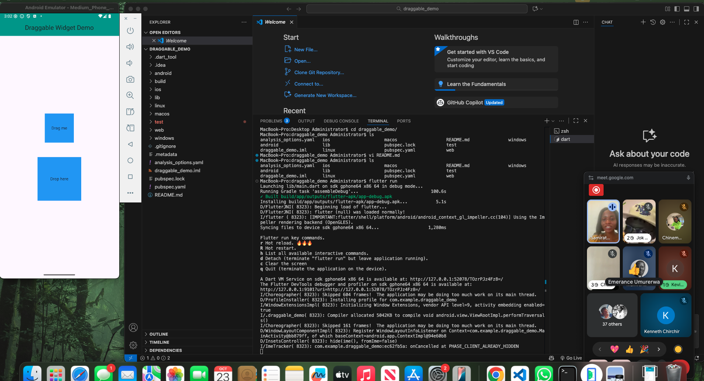

# Draggable Widget Demo 🟦

A simple Flutter app demonstrating the **Draggable** widget. Drag the blue box into the target area to change the target’s color.

## How to Run
1. Clone the repository:
   git clone https://github.com/YOUR-USERNAME/draggable_demo.git
2. Navigate into the project folder:
   cd draggable_demo
3. Run the app:
   flutter run

## Widget: Draggable
The `Draggable` widget allows users to move widgets across the screen and interact with `DragTarget`.

### Attributes Demonstrated
| Attribute | Description |
|-----------|-------------|
| feedback | Widget displayed while dragging |
| childWhenDragging | Widget displayed at the original spot while dragging |
| data | Data sent to DragTarget on drop |

## Screenshot

## Presentation Date
(Thursday October 23rd)

## Reference
[Flutter Draggable Widget](https://api.flutter.dev/flutter/widgets/Draggable-class.html)

~                                                                                                             
~                                                                                                             
~                                                                                                             
~                                                                                                             
~                                                                                                             
~
